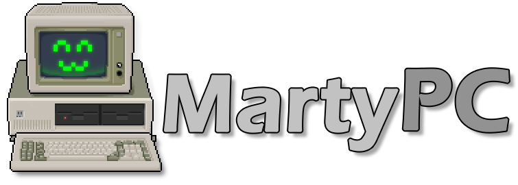
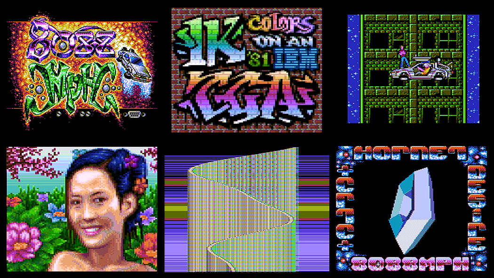
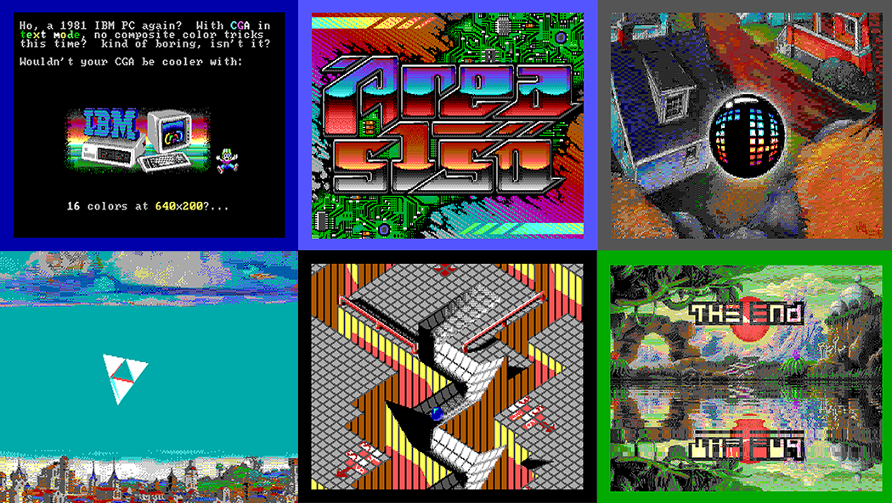
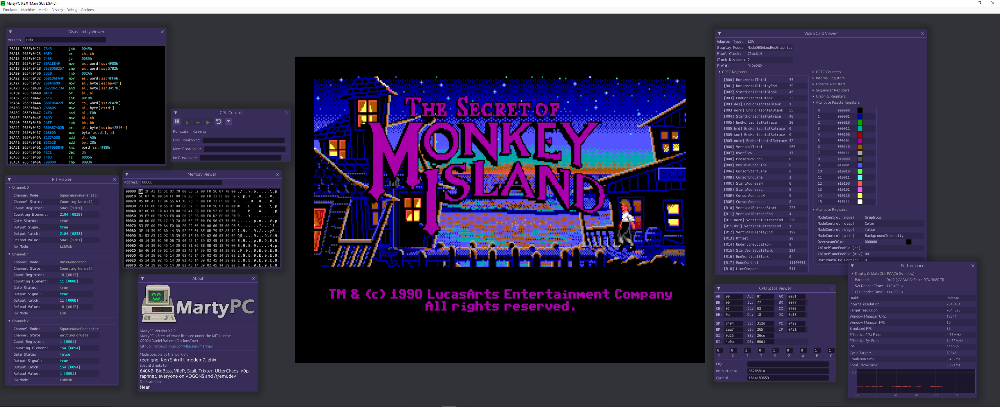
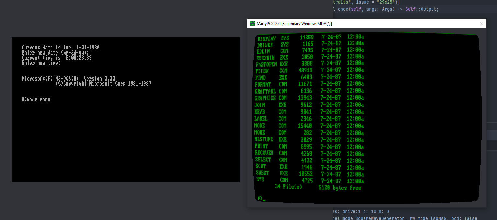

MartyPC is a cross-platform IBM PC emulator written in Rust, for Windows, Linux and macOS.

## User Guide

[Click here to access the MartyPC User Guide](https://github.com/dbalsom/martypc/wiki/MartyPC-User-Guide)

## Downloading MartyPC

Builds are available through periodic [releases](https://github.com/dbalsom/martypc/releases). Newer, automatic builds are available via the [Actions tab](https://github.com/dbalsom/martypc/actions/) under the Artifacts for each workflow run. (You will need to be logged in to GitHub to download Artifacts).

## Why another PC emulator?

MartyPC began as a hobby project to see if I could write an emulator from scratch while learning the Rust programming 
language. My original goals for MartyPC were modest, but it has reached a level of functionality that I could have never 
imagined.

MartyPC's intended niche in the emulation world is an aide for retro PC development. It is packed with debugging tools
and logging facilities, with many more planned. It may not be as user-friendly to set up as other emulators, but if you
are familiar with edting configuration files you shouldn't have any major problems.

## Accuracy

Development of MartyPC started in April 2022. I began work on making MartyPC's 8088 CPU emulation cycle-accurate in 
November 2022. To do so, I validated the operation of the CPU against a real 8088 CPU connected to an Arduino MEGA 
microcontroller. See my [Arduino8088 project](https://github.com/dbalsom/arduino_8088) for more details. This allows an instruction to be simultaneously 
executed on the emulator and a real CPU and the execution results compared, cycle-by-cycle. More info on this process is
described [on my blog](https://martypc.blogspot.com/2023/06/hardware-validating-emulator.html).

Extensive hardware research has been performed to improve MartyPC's peripheral emulation as well, including
investigating the 8253 timer chip with an Arduino, investigating
[DMA timings with an oscilloscope](https://martypc.blogspot.com/2023/05/exploring-dma-on-ibm-pc.html), and ultimately, 
[building a bus sniffer](https://martypc.blogspot.com/2023/10/bus-sniffing-ibm-5150.html) using a logic analyzer.

In April 2023, MartyPC became accurate enough to run the infamous PC demo, 
[8088 MPH](https://www.pouet.net/prod.php?which=65371).

In May 2023, MartyPC became the first PC emulator capable of emulating every effect in the PC demo 
[Area 5150](https://www.pouet.net/prod.php?which=91938). (See video here: https://www.youtube.com/watch?v=zADeLm9g0Zg)

## Online Demos

The WebAssembly build of MartyPC can run both [8088MPH](https://dbalsom.github.io/martypc/web/player.html?title=8088mph) and [Area 5150](https://dbalsom.github.io/martypc/web/player.html?title=area5150) in your web browser!

## Features

Currently, MartyPC can emulate an original IBM 5150 PC, 5160 XT, or a generic XT clone machine.

### Device Support
Besides emulating the 8088 CPU, MartyPC emulates the following devices:

* **CGA** - A dynamic, cycle-or-character clocked implementation of the IBM CGA including the Motorola MC6845 CRTC controller allows MartyPC to run demanding PC demos like 8088MPH and Area5150. MartyPC takes a unique approach to PC video card emulation by simulating the entire display field - including overscan. Composite output and monitor simulation is supported, via reenigne's excellent composite conversion code (also used by DOSBox and 86Box) 
* **MDA** - A character-clocked implementation of the IBM MDA card built on the Motorola MC6845 CRTC controller. An MDA adapter can be installed alongside a CGA or EGA card for multi-monitor operation.
* **EGA** - A character-clocked implementation of the IBM EGA builds on the techniques used developing the CGA. It is structured to replicate the logical functions of each of the LSI chips on the original hardware. It supports redefinable fonts, vsync interrupts and per-scanline pel-panning for smooth scrolling.  
* **µPD765 FDC** - Currently robust enough to support both DOS and Minix operating systems, although floppy image emulation is limited to raw sector images.
* **IBM/Xebec 20MB HDC** - Emulated with basic VHD support. MartyPC currently supports a single disk geometry of 20MB.
* **8255 PPI** - Low level keyboard emulation is supported via the PPI and keyboard shift register. Supports the 'turbo bit' found in TurboXT clones.
* **8259 PIC** - Mostly complete, but still missing advanced features such as priority rotation and nested modes.
* **8253 PIT** - Highly accurate, supporting PCM audio.
* **8237 DMAC** - Mostly implemented, but DMA transfers are currently "faked". DRAM refresh DMA is simulated using a scheduling system.
* **8250 UART** - Supports serial passthrough or mouse emulation. Still a bit incomplete (fails tests in CheckIt)
* **Mouse** - A standard Microsoft serial mouse can be connected to the COM port of your choice.
* **PC Speaker** - Although sometimes a little glitchy, it can produce reasonable PCM audio in demos such as 8088MPH, Area5150, and Magic Mushroom.

### Configuration Support

MartyPC supports custom machine configurations via base machine configuration profiles plus optional extensions called
'overlays', analagous to installing extension cards or other upgrades.

### Debugging Support

MartyPC has an extensive debugging GUI with several useful displays including instruction disassembly, CPU state, memory viewer,
and various peripheral states. Code and memory breakpoints are supported. MartyPC also supports instruction and cycle-based logging.

### Multi-window support

Run two video cards in separate windows, or the same video card in 'accurate' and 'debug' views - or with different shaders!

### Shader support

A basic, configurable CRT shader is included with more to come 
([LibraShader](https://github.com/SnowflakePowered/librashader) support is planned)

## Screenshots

For more, check out the [Screenshot Gallery section of the Wiki](https://github.com/dbalsom/martypc/wiki/Screenshot-Gallery)!

## Special Thanks

I have a long list of people to thank (See the About box!) but I would especially like to mention the contributions made by [reenigne](https://www.reenigne.org/blog/). Without his work reverse-engineering the 8088 microcode, this emulator would never have been possible. I would also like to thank Ken Shirriff and [his excellent blog](https://github.com/dbalsom/martypc/actions/), covering much of the silicon logic of the 8086 (and 8088 by extension).
